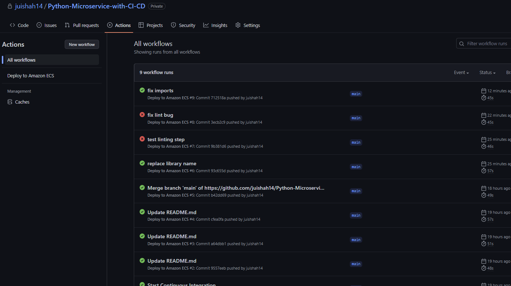
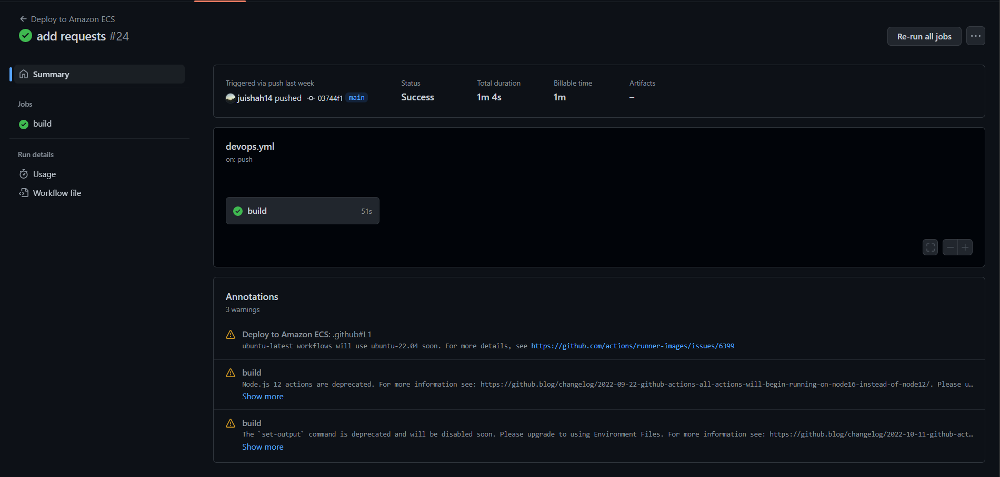
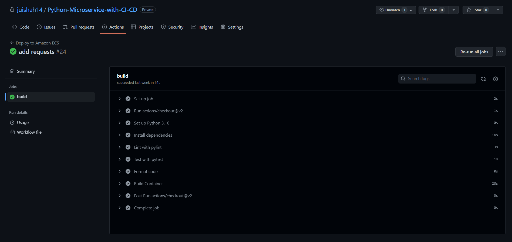

# Python Microservice with CI/CD

### Tools: Fast API, Nasa API, Docker, AWS

 

This Python Microservice equipped with CI/CD was developed using the NASA API, Fast API, Docker, and AWS services (ECR, Codebuild, ECS/App Runner). Using the defined routes, users can retrieve information on NASA and its various missions and scientific discoveries, as well as perform a search of the NASA Image and Video library.

This Containerized Paas Microservice has been designed such that it can be scaled to create a production-level Dev-Ops workflow and infrastructure, equipped with unit and end-to-end tests, formatting and lint checks, and continuous deployment of your container to AWS.

 

#### Continuous Integration:

A Github workflow has been set up to aid in facilitating smooth continuous integration. The workflow performs a build which installs dependencies, formats and lints code, runs tests, and containerizes code, as well as sends an email to the repo owner upon any build failures.

 

#### Continuous Deployment:  
In order to set up containerized continuous deployment, this repo can be connected to AWS Codebuild. This will allow for new images to be built upon any pushes to main, and for these images to then be pushed directly to ECR.  

To set this up, create a build project with AWS Codebuild and configure it such that:

1. It allows for webhooks (so that a new image for the container will be built upon any changes to main)
2. It uses a buildspec.yml file which uses the commands listed in the Makefile (eg. make format, make deploy, etc.)

After this, ECR can be connected to either AWS ECS or AWS App Runner, in order to continuously deploy our newest container.

To use ECS, create a cluster and then a new service which uses that cluster. The service should be given a task definition so that it knows which Docker image to use from ECR.

To use App Runner, create a service which uses ECR. App Runner can then monitor your container registry and deploy a new version of your service for each image push. It will also give you a domain/url on which your service (in this case an API) is being hosted.

 

#### Local Development:  
Requires Docker Desktop.
Enter virtual environment - `venv/Scripts/Activate.ps1`  
Build, test, and run locally -

1. `docker build -t nasa-api .`
2. `docker images`
3. `docker run -p 8080:8080 <image-id>`
4. Visit `localhost:8080` to use any of the pre-defined routes
